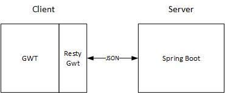

# Spring Boot GWT

[](https://travis-ci.org/feedm3/spring-boot-gwt)
[](http://badges.mit-license.org)
[](https://dependencyci.com/github/feedm3/spring-boot-gwt)
[](https://img.shields.io/badge/Actively%20Maintained-%E2%9C%94-brightgreen.svg?style=flat-square)

[](https://heroku.com/deploy?template=https://github.com/feedm3/spring-boot-gwt/blob/master)

This is a demo project to show Spring Boot in conjunction with GWT. It uses the latest dependencies
(Spring Boot 1.5.4 and GWT 2.8.1) and Java 8. The deployed app can be found [here](https://spring-boot-gwt.herokuapp.com/).

## Run

To run this project you have to start Spring Boot and GWT separate. If you use IntelliJ the run configurations
to do this are already present in this repo. _Note that you have to set the path to the static html file in your project strutures "Web" module to the [`static/resource`](src/main/resources/static) folder. Otherwise GWT will not find the index.html._

Spring Boot can also be started with gradle.

```
gradlew bootRun
```

## Test

Currently only the server side code is tested. To run the tests use the following command

```
gradlew test
```

We use [Spock](https://github.com/spockframework/spock) as testing framework because of the great
readability, syntax and built in features.

#### Outdated dependencies

To check for outdated dependencies
```
gradlew dependencyUpdates -Drevision=release
```

## Build

The project con be build to a single jar file with an embedded tomcat:

```
gradlew build
```

After gradle build the project the finished jar file is in `build/libs/spring-boot-gwt-1.0.0.jar`
and can simply be started with

```
java -jar spring-boot-gwt-1.0.0.jar
```

### Heroku

To deploy this app to heroku use the __Deploy to Heroku__ Button on the top.

Heroku uses the gradle `stage` task to build the project. Because Spring Boot puts everything we
need into the jar file we only have to tell heroku to execute this jar file.

## Technical Details



The client side and server side are strictly separated. The GWT files are in the `client` package
(except the `.gwt.xml`) and the server side code is in the `server` package. All static client code
like the `index.html` and css files are inside the [`static`](src/main/resources/static) folder. Gradle
will also put the compiled sources in this folder.

The communication is made via JSON for which reason we have make 2 implementations of the object we
send (POJO in the frontend and POJO with javax annotations in the backend).
